# 元景万悟智能体平台-文档解析服务

<div align="center">
  

  <p>
    <a href="#功能介绍">功能介绍</a> •
    <a href="#本地部署">本地部署</a> •
    <a href="#数据协议">数据协议</a> •
    <a href="#使用服务">使用服务</a> •
    <a href="#联系我们">联系我们</a> 
  </p>

  <p>
    
    
    <a href="https://github.com/UnicomAI/DocParserServer/releases">
      
    </a>
  </p>

  <p>
    <a href="https://github.com/UnicomAI/DocParserServer/blob/main/README_EN.md">English</a> | 中文
  </p>
</div>


&emsp;&emsp;**万悟文档解析服务**是一款面向**企业级**场景的通用文档解析服务，通过引入AI能力和多种业界领先的视觉文档解析模型，精准、高效的将各类文档转化为 Markdown 结构化标准格式，支持提取文档中的多模态元素，例如表格、公式、图片等，将复杂多模态知识转换为结构化的表示有助于大语言模型对这些多模态知识的理解。借助该服务，预先将各类非结构化文档提取内容成文本信息后，再把结构化的文本信息写入知识库进行向量索引构建，可以显著提升RAG知识问答、智能体知识库节点等知识问答场景的效果。该服务可独立使用，也可作为模型服务配置接入**元景万悟智能体平台**([github项目地址](https://github.com/UnicomAI/wanwu/edit/main/README_CN.md))供知识库文档解析使用。目前服务已接入PaddleOCR-VL、MinerU等业界主流模型，并在业界首发了PaddleOCR-VL、MinerU模型的昇腾910B部署镜像，在原生模型对pdf和图片文件基础上扩展了对doc, docx, ppt, pptx等文档的支持。未来将提供更多文档解析模型增益能力，敬请期待！

------


## 📢近期更新

🔥 **2026.2.6**: 新增基于PaddleOCR-VL 1.5的文档解析推理任务（基于英伟达系列显卡，华为910B适配中，敬请期待），跨页表格自动聚合，JSON结构化数据block_content字段结构化展示。


------


## 功能介绍

支持多类型文档解析并按markdown标准格式输出，支持标题层级、表格、公式、图片等复杂多模知识高质量解析。

其中：
- 表格转换为HTML格式输出
- 公式以LaTeX语法格式输出
- 图片以Minio链接/本地链接输出

同时支持联通元景MaaS API的云端调用与私有化部署，开源部署镜像参见：[本地部署](#本地部署)


### 文档解析的关键特点

- **多样化内容提取**：支持提取图像、图像描述、表格、表格标题和脚注
  
- **公式转换**：自动识别文档中的公式并转换为LaTeX格式
  
- **表格转换**：自动识别文档中的表格并转换为HTML格式

- **跨页表格合并**：自动合并文档中的跨页表格，保持表格结构和表头信息

- **OCR功能**：自动检测扫描版PDF和乱码PDF，并启用OCR功能
  
- **多语言支持**：OCR功能支持多种语言的检测和识别
  
- **MarkDown格式输出**：支持按Markdown标准格式输出，对大模型理解格式更友好

- **JSON格式输出**：支持按JSON结构化格式输出，对结构细粒度的提取、解析效果优化以及需求二次开发友好
  
- **多种运行环境**：支持纯CPU环境运行，并支持GPU(CUDA)/NPU(mineru已适配)加速

### OmniDocBench 1.5评测集效果评测

元景万悟高精度文档解析服务在权威开源数据集OmniDocBench 1.5上完成性能指标评测，综合指标**与PaddleOCR-VL模型基本持平**（其中公式指标高出0.4%），**综合指标和各项指标均超过MinerU2.5**，解析精度达到业界领先水平。

<table align="center" border="1" cellpadding="6" cellspacing="0">
  <thead>
    <!-- 第一行表头：合并table列 -->
    <tr>
      <th align="center">文档解析模型</th>
      <th align="center">overall</th>
      <th align="center">text</th>
      <th align="center">formula</th>
      <th align="center" colspan="2">table</th> <!-- 合并2个table单元格 -->
      <th align="center">reading order</th>
    </tr>
    <!-- 第二行表头：仅table列显示子指标 -->
    <tr>
      <th align="center"></th> <!-- 空单元格 -->
      <th align="center"></th> <!-- 空单元格 -->
      <th align="center">Normalized edit distance</th>
      <th align="center">CDM</th>
      <th align="center">TEDS</th> <!-- table子指标1 -->
      <th align="center">TEDS_structure</th> <!-- table子指标2 -->
      <th align="center">Normalized edit distance</th>
    </tr>
  </thead>
  <tbody>
    <tr>
      <td align="center"><strong>联通元景万悟文档解析服务</strong></td> <!-- 加粗 -->
      <td align="center">94.53</td>
      <td align="center">0.034</td>
      <td align="center">94.49</td>
      <td align="center">91.65</td> <!-- table-TEDS -->
      <td align="center">94.66</td> <!-- table-TEDS_structure -->
      <td align="center">0.042</td>
    </tr>
    <tr>
      <td align="center">paddleOCR-VL</td>
      <td align="center">92.86</td>
      <td align="center">0.035</td>
      <td align="center">91.22</td>
      <td align="center">90.89</td>
      <td align="center">94.76</td>
      <td align="center">0.043</td>
    </tr>
    <tr>
      <td align="center">联通元景万悟文档解析910B</td>
      <td align="center">92.62</td>
      <td align="center">0.036</td>
      <td align="center">91.51</td>
      <td align="center">89.96</td> <!-- table-TEDS -->
      <td align="center">93.50</td> <!-- table-TEDS_structure -->
      <td align="center">0.045</td>
    </tr>
    <tr>
      <td align="center">mineru2.5</td>
      <td align="center">90.67</td>
      <td align="center">0.047</td>
      <td align="center">88.46</td>
      <td align="center">88.22</td>
      <td align="center">92.38</td>
      <td align="center">0.044</td>
    </tr>
    <!-- 新增 MonkeyOCR-pro-3B 行 -->
    <tr>
      <td align="center">MonkeyOCR-pro-3B</td>
      <td align="center">88.85</td>
      <td align="center">0.075</td>
      <td align="center">87.25</td>
      <td align="center">86.78</td>
      <td align="center">90.63</td>
      <td align="center">0.128</td>
    </tr>
  </tbody>
</table>

<div align="center">

</div>

<div align="center">
  
|            文本指标             |       公式指标        | 表格指标 | 阅读顺序指标 |
|:-------------------------:|:---------------------:| :---: |  :---: |
| 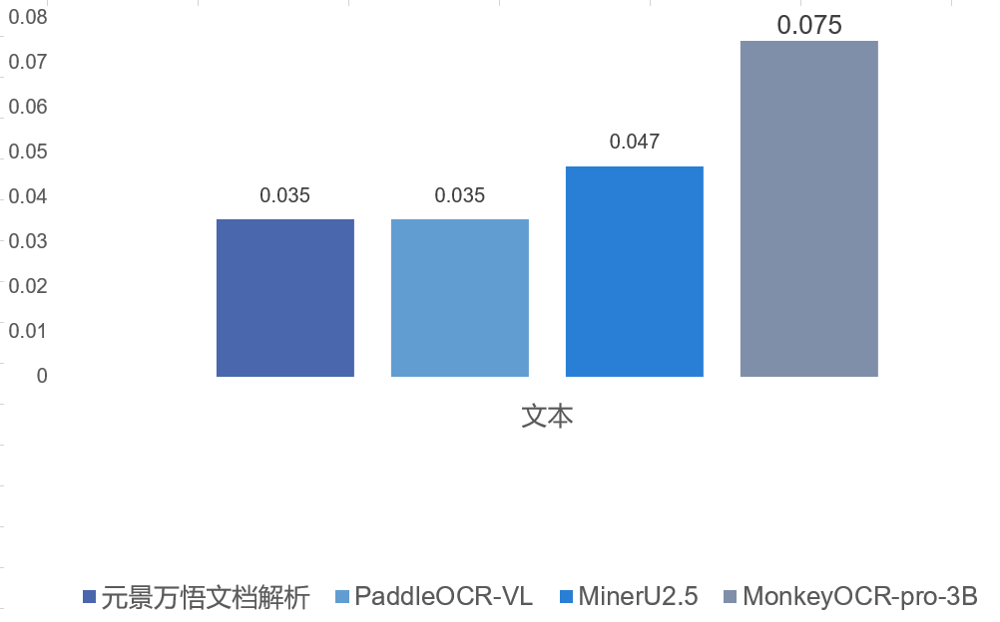 | 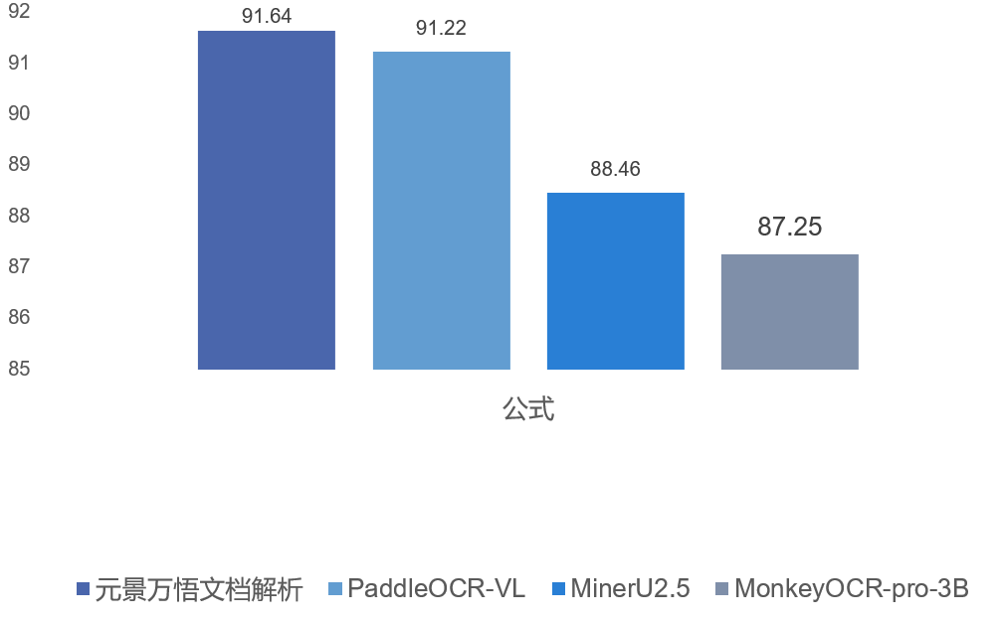 | 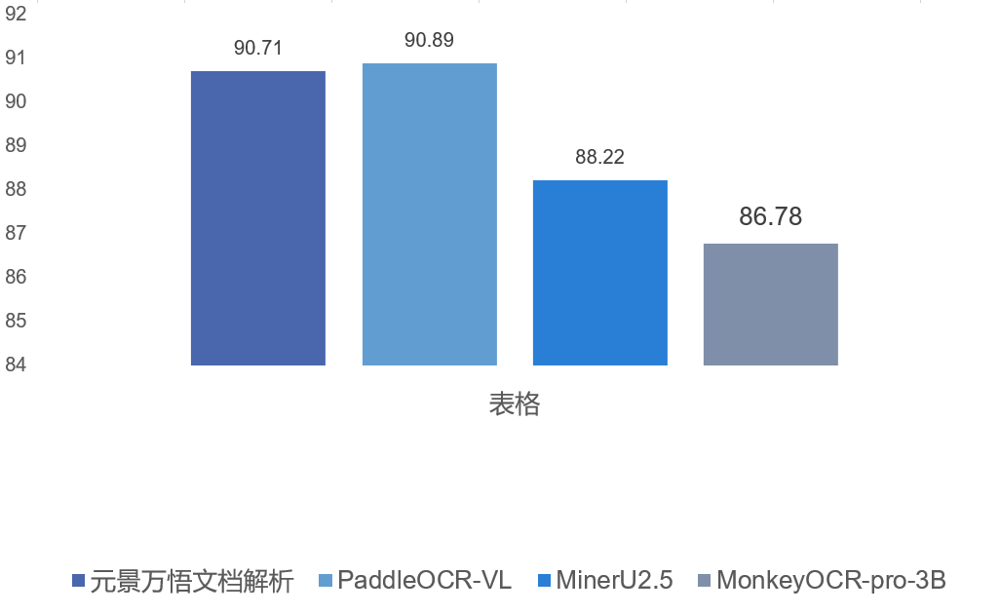 | 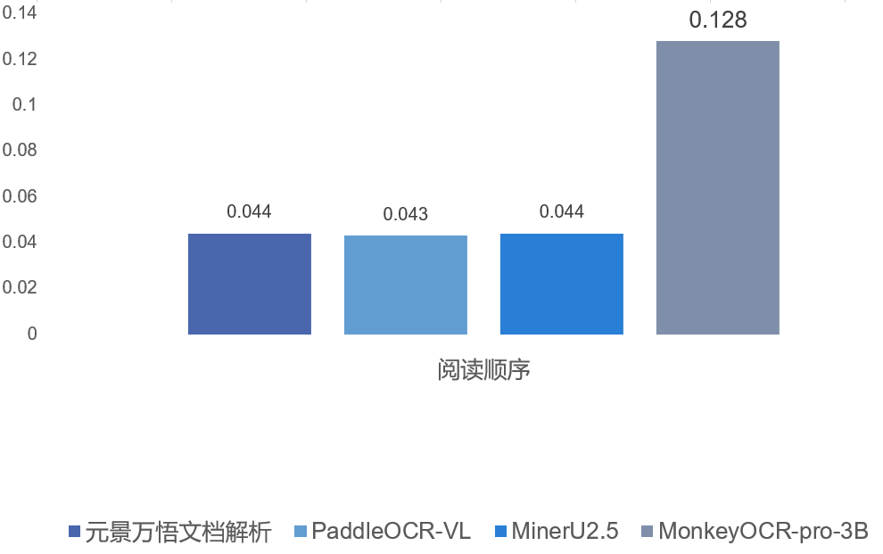 | 

</div>

## 文档解析效果展示
文本内容解析：
|            原图             |       paddleocrvl 解析结果        | mineru 解析结果 |
|:-------------------------:|:---------------------:| :---: |
| 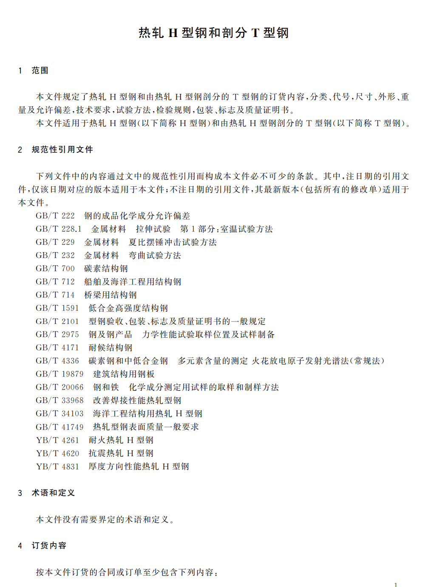 | 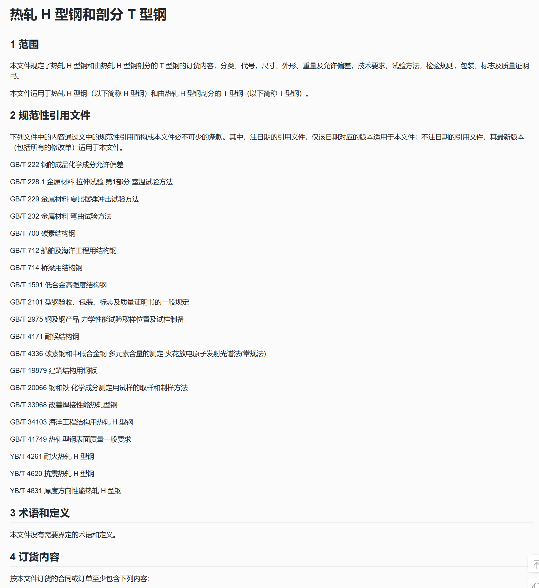 | 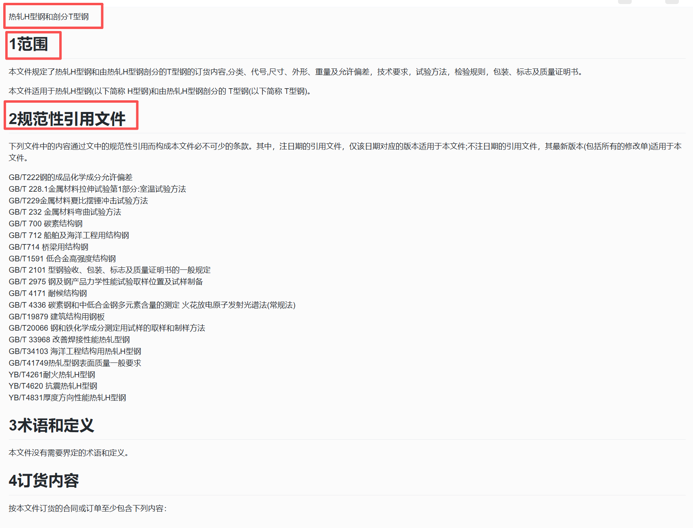 |

paddle模型更精确提取了文本的标题层级结构。

表格内容解析：
|            原图             |       paddleocrvl 解析结果        | mineru 解析结果 |
|:-------------------------:|:---------------------:| :---: |
| 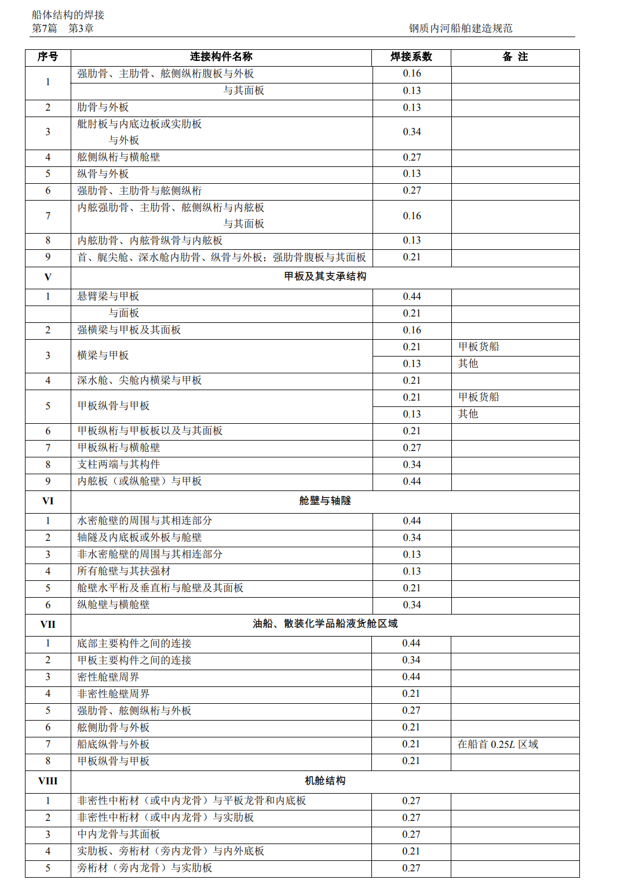 | 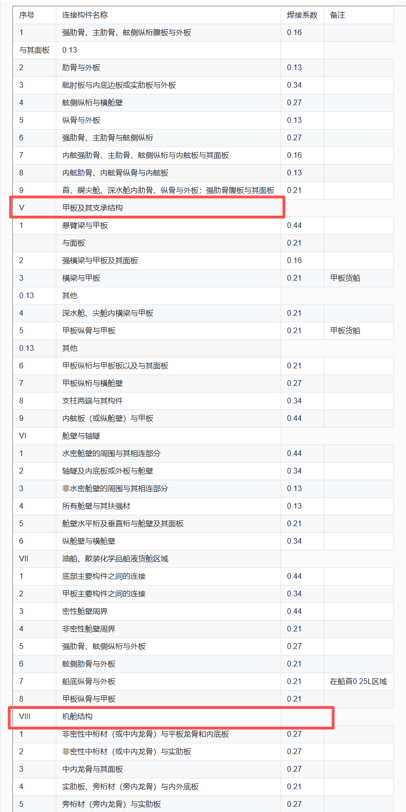 |  |

paddle模型更精确的还原表格结构和文本。

图片、公式内容解析：
|            原图             |       paddleocrvl 解析结果        | mineru 解析结果 |
|:-------------------------:|:---------------------:| :---: |
| 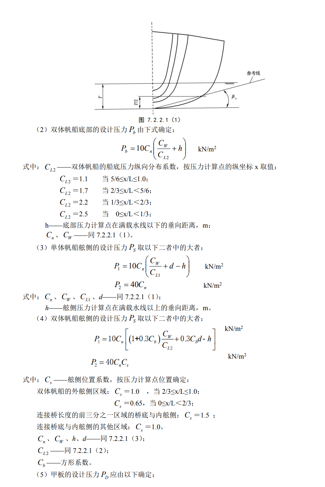 | 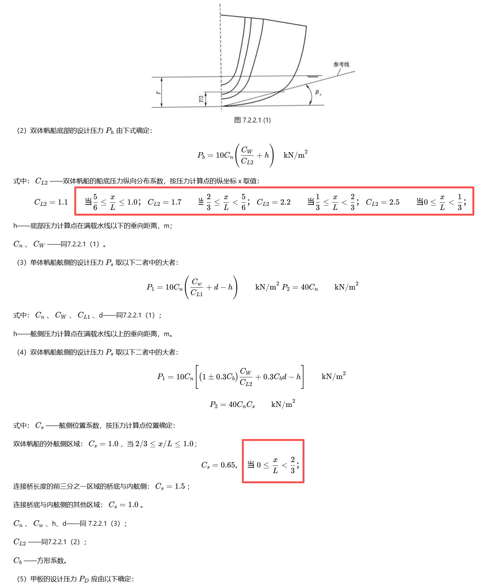 | 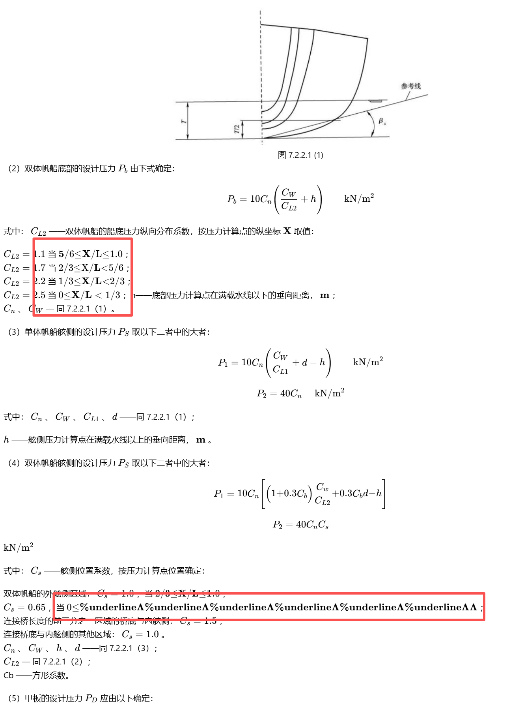 |

对公式的提取均表现良好，paddle模型能够更精确的可视化还原部分公式内容。
同时基于这两种模型的服务均支持提取图片链接。即将支持图片中的文本内容识别，敬请期待！


## 本地部署

### 通过镜像安装(推荐)
镜像中包含python，conda等服务运行需要的依赖和模型。下面提供了不同cpu架构，GPU资源，以及paddle和mineru两种模型镜像部署方式，**请选择下面一种适合您场景的模型与硬件资源**组合方式进行部署。

---
#### 方案一：基于PaddleOCR-VL 1.5模型，在X86架构，通过Nvidia显卡推理的部署方案，性能与效果最优
如果您是Nvidia显卡用户，且CUDA驱动版本≥550.xx.xx, 建议使用基于paddleocr的专用推理镜像，目前仅支持在x86架构上运行。
##### 步骤1：拉取模型服务基础镜像
```bash
# x86/amd64
docker pull crpi-6pj79y7ddzdpexs8.cn-hangzhou.personal.cr.aliyuncs.com/wanwulite/doc_parser_server:1.3-20260205-amd64-paddle
docker pull ccr-2vdh3abv-pub.cnc.bj.baidubce.com/paddlepaddle/paddleocr-genai-fastdeploy-server:latest-nvidia-gpu-offline
```
##### 步骤2：启动模型服务容器
```bash
# 启动doc_parser_server容器
docker run -d --name doc_parser \
-p 8083:8083 \
--network wanwu-net \  #如果不与万悟平台集成使用服务，则删除本行
--restart always \
-e MODEL_TYPE="paddleocrvl" \
-e MODEL_ADDRESS="http://{ip}:8118/v1" \ #ip替换为宿主机的IP地址
-e USE_CUSTOM_MINIO="false" \  #如果不与万悟平台集成使用服务，则设置为True，使用自定义Minio
-e MINIO_ADDRESS="minio-wanwu:9000" \
-e MINIO_ACCESS_KEY="root" \
-e MINIO_SECRET_KEY="your_sk" \
-e BFF_SERVICE_MINIO="http://bff-service:6668/v1/api/deploy/info" \  #如果不与万悟平台集成使用服务，则删除本行
-e STIRLING_ADDRESS="http://192.168.0.21:8080/api/v1/convert/file/pdf" \  #如果不使用扩展功能1：多类型文档解析，则删除本行
crpi-6pj79y7ddzdpexs8.cn-hangzhou.personal.cr.aliyuncs.com/wanwulite/doc_parser_server:1.2-20251112-amd64-paddle \
sh -c "chmod +x /app/DocParserServer-main/docker_start_app.sh && /app/DocParserServer-main/docker_start_app.sh"
# 启动paddleocrvl容器
docker run \
    -it \
    --rm \
    --gpus all \
    --network host \
    ccr-2vdh3abv-pub.cnc.bj.baidubce.com/paddlepaddle/paddleocr-genai-fastdeploy-server:latest-nvidia-gpu-offline \
    paddleocr genai_server --model_name PaddleOCR-VL-0.9B --host 0.0.0.0 --port 8118 --backend vllm
```

---
#### 方案二：基于PaddleOCR-VL模型，在ARM架构，通过华为昇腾系列910B显卡推理的部署方案，性能与效果在同样硬件资源下最优
##### 步骤1：拉取模型服务基础镜像
```bash
# arm64
docker pull crpi-6pj79y7ddzdpexs8.cn-hangzhou.personal.cr.aliyuncs.com/wanwulite/doc_parser_server:1.3-20260130-arm64-paddle-910b
```
##### 步骤2：启动模型服务容器
```bash
# 启动doc_parser_server容器
docker run --rm \
    --name doc_parser \
    -p 8083:8083 \
    --network wanwu-net \  #如果不与万悟平台集成使用服务，则删除本行
    --restart always \
    -e USE_CUSTOM_MINIO="false" \  #如果不与万悟平台集成使用服务，则设置为True，使用自定义Minio
    -e MINIO_ADDRESS="minio-wanwu:9000" \
    -e MINIO_ACCESS_KEY="root" \
    -e MINIO_SECRET_KEY="your_sk" \
    -e BFF_SERVICE_MINIO="http://bff-service:6668/v1/api/deploy/info" \  #如果不与万悟平台集成使用服务，则删除本行
    -e STIRLING_ADDRESS="http://192.168.0.21:8080/api/v1/convert/file/pdf" \  #如果不使用扩展功能1：多类型文档解析，则删除本行
    --shm-size=10g \
    --device /dev/davinci0 \   # 替换成你需要的卡
    --device /dev/davinci_manager \
    --device /dev/devmm_svm \
    --device /dev/hisi_hdc \
    -v /usr/local/dcmi:/usr/local/dcmi \
    -v /usr/local/Ascend/driver/tools/hccn_tool:/usr/local/Ascend/driver/tools/hccn_tool \
    -v /usr/local/bin/npu-smi:/usr/local/bin/npu-smi \
    -v /usr/local/Ascend/driver/lib64/:/usr/local/Ascend/driver/lib64/ \
    -v /usr/local/Ascend/driver/version.info:/usr/local/Ascend/driver/version.info \
    -v /etc/ascend_install.info:/etc/ascend_install.info \
    -v /root/.cache:/root/.cache \
    crpi-6pj79y7ddzdpexs8.cn-hangzhou.personal.cr.aliyuncs.com/wanwulite/doc_parser_server:1.3-20260130-arm64-paddle-910b \
    bash -c "chmod +x /app/docker_start_all.sh && /app/docker_start_all.sh"
```


---
#### 方案三：基于MinerU在ARM64架构，通过CPU或Nvidia显卡推理的部署方案
##### 步骤1：拉取模型服务基础镜像
```bash
# arm64
docker pull crpi-6pj79y7ddzdpexs8.cn-hangzhou.personal.cr.aliyuncs.com/wanwulite/doc_parser_server:1.2-20251016-arm64
```
##### 步骤2：启动模型服务容器
```bash
# BFF_SERVICE_MINIO依赖万悟平台的部署，部署后可以获取到这个接口
docker run -d --name doc_parser \
-p 8083:8083 \
--network wanwu-net \
--restart always \
-e USE_CUSTOM_MINIO="false" \
-e MINIO_ADDRESS="minio-wanwu:9000" \
-e MINIO_ACCESS_KEY="root" \
-e MINIO_SECRET_KEY="your_sk" \
-e BFF_SERVICE_MINIO="http://bff-service:6668/v1/api/deploy/info" \
-e STIRLING_ADDRESS="http://192.168.0.21:8080/api/v1/convert/file/pdf" \
crpi-6pj79y7ddzdpexs8.cn-hangzhou.personal.cr.aliyuncs.com/wanwulite/doc_parser_server:1.2-20251016-arm64 \
sh -c "chmod +x /app/start_all.sh && /app/start_all.sh"
```

---
#### 方案四：基于MinerU在X86_64架构，通过CPU或Nvidia显卡推理的部署方案
##### 步骤1：拉取模型服务基础镜像
```bash
# x86_64
docker pull crpi-6pj79y7ddzdpexs8.cn-hangzhou.personal.cr.aliyuncs.com/wanwulite/doc_parser_server:1.2-20251016-amd64
```
##### 步骤2：启动模型服务容器
```bash
# BFF_SERVICE_MINIO依赖万悟平台的部署，部署后可以获取到这个接口
docker run -d --name doc_parser \
-p 8083:8083 \
--network wanwu-net \
--restart always \
-e USE_CUSTOM_MINIO="false" \
-e MINIO_ADDRESS="minio-wanwu:9000" \
-e MINIO_ACCESS_KEY="root" \
-e MINIO_SECRET_KEY="your_sk" \
-e BFF_SERVICE_MINIO="http://bff-service:6668/v1/api/deploy/info" \
-e STIRLING_ADDRESS="http://192.168.0.21:8080/api/v1/convert/file/pdf" \
crpi-6pj79y7ddzdpexs8.cn-hangzhou.personal.cr.aliyuncs.com/wanwulite/doc_parser_server:1.2-20251016-amd64 \
sh -c "chmod +x /app/start_all.sh && /app/start_all.sh"
```

---
#### 方案五：基于MinerU在arm64架构，通过华为昇腾910B NPU推理的部署方案
##### 步骤1：拉取模型服务基础镜像
```bash
# arm64
docker pull crpi-6pj79y7ddzdpexs8.cn-hangzhou.personal.cr.aliyuncs.com/wanwulite/doc_parser_server:1.2-20251022-arm64-910b
```

##### 步骤2：启动模型服务容器
```bash
# BFF_SERVICE_MINIO依赖万悟平台的部署，部署后可以获取到这个接口
docker run -d \
  -p 8083:8083 \
  --name doc_parser_910b \
  --device=/dev/davinci4 \
  --device=/dev/davinci_manager \
  --device=/dev/devmm_svm \
  --device=/dev/hisi_hdc \
  -v /usr/local/bin/npu-smi:/usr/local/bin/npu-smi \
  -v /usr/local/Ascend/driver/:/usr/local/Ascend/driver \
  -v /usr/local/Ascend/add-ons/:/usr/local/Ascend/add-ons/ \
  -v /var/log/npu/conf/slog/slog.conf:/var/log/npu/conf/slog/slog.conf \
  -v /var/log/npu/slog/:/var/log/npu/slog \
  -v /var/log/npu/profiling/:/var/log/npu/profiling \
  -v /var/log/npu/dump/:/var/log/npu/dump \
  -v /var/log/npu/:/usr/slog \
  -e USE_CUSTOM_MINIO="false" \
  -e MINIO_ADDRESS="minio-wanwu:9000" \
  -e MINIO_ACCESS_KEY="root" \
  -e MINIO_SECRET_KEY="V5EMfXAuCCx3JkjTG4jQ" \
  -e BFF_SERVICE_MINIO="http://bff-service:6668/v1/api/deploy/info" \
  -e STIRLING_ADDRESS="http://192.168.0.21:8080/api/v1/convert/file/pdf" \
  crpi-6pj79y7ddzdpexs8.cn-hangzhou.personal.cr.aliyuncs.com/wanwulite/doc_parser_server:1.2-20251022-arm64-910b \
  bash /app/start_all.sh
```

---
#### 扩展功能1: 多类型文档解析, 如需要直接输入doc\docx\ppt\pptx文档进行解析, 则需要额外安装此部分功能
##### 步骤1：拉取模型服务基础镜像
```bash
docker pull stirlingtools/stirling-pdf:latest-fat
```
##### 步骤2：启动多类型文档服务容器
```bash
# 如果需要解析doc\docx\ppt\pptx文档，继续执行以下命令启动服务。如不需要，则完成安装。
docker run -d \
  --name stirling-pdf \
  -p 8080:8080 \
  -v "./StirlingPDF/trainingData:/usr/share/tessdata" \
  -v "./StirlingPDF/extraConfigs:/configs" \
  -v "./StirlingPDF/customFiles:/customFiles/" \
  -v "./StirlingPDF/logs:/logs/" \
  -v "./StirlingPDF/pipeline:/pipeline/" \
  -e DISABLE_ADDITIONAL_FEATURES=true \
  -e LANGS=en_GB \
  docker.stirlingpdf.com/stirlingtools/stirling-pdf:latest
```

<span style="color:red;font-weight:bold;"> 注意：docker run中的环境变量参数，需要根据实际情况进行修改。</span>

#### 环境变量配置方法：

##### 场景1：独立部署使用文档解析服务的环境变量
| 环境变量              | 定义                                                                                                           |
|-------------------|--------------------------------------------------------------------------------------------------------------|
| MODEL_TYPE        | 使用的模型类型，MinerU镜像无需配置，其他镜像需要选择模型类型，枚举如下：mineru/paddleocrvl。                                                   |
| MODEL_ADDRESS     | 模型服务的调用地址。仅选择除mineru外的模型需要配置，paddleocrvl配置方式：http://{ip}:8118/v1（ip为宿主机ip）                                   |
| USE_CUSTOM_MINIO  | 设置为true，使用自定义MinIO服务。                                     |
| MINIO_ADDRESS     | MinIO服务的地址，通过万悟使用本服务时复用万悟的minio地址。默认加入wanwu-net网络，通过minio-wanwu:9000访问，无需修改。自定义minio服务填写ip:port（不要加http://）。 |
| MINIO_ACCESS_KEY  | MinIO服务的ak，默认root。                                                                                           |
| MINIO_SECRET_KEY  | MinIO服务的sk，<span style="color:red;">无有效默认值，必须自行填写</span>。                                                    |
| STIRLING_ADDRESS  | 仅解析doc\docx\ppt\pptx文档需要，否则忽略此参数。参数赋值使用本机ip+映射的端口默认8080。                                             |


##### 场景2：在万悟平台接入文档解析服务的环境变量
| 环境变量              | 定义                                                                                                           |
|-------------------|--------------------------------------------------------------------------------------------------------------|
| MODEL_TYPE        | 使用的模型类型，MinerU镜像无需配置，其他镜像需要选择模型类型，枚举如下：mineru/paddleocrvl。                                                   |
| MODEL_ADDRESS     | 模型服务的调用地址。仅选择除mineru外的模型需要配置，paddleocrvl配置方式：http://{ip}:8118/v1（ip为宿主机ip）                                   |
| USE_CUSTOM_MINIO  | 设置为false，配置万悟平台的MinIO服务，已实现在智能问答时可以展示文档解析后提取到的图片。                                       |
| MINIO_ADDRESS     | MinIO服务的地址，通过万悟使用本服务时复用万悟的minio地址。默认加入wanwu-net网络，通过minio-wanwu:9000访问，无需修改。自定义minio服务填写ip:port（不要加http://）。 |
| MINIO_ACCESS_KEY  | MinIO服务的ak，默认root。                                                                                           |
| MINIO_SECRET_KEY  | MinIO服务的sk，<span style="color:red;">无有效默认值，必须自行填写</span>。                                                    |
| BFF_SERVICE_MINIO | 万悟MinIO服务api地址，用于获取图片在MinIO地址，默认为：http://bff-service:6668/v1/api/deploy/info。通常无需修改，除非您在部署万悟时修改了访问MinIO的链接。                                  |
| STIRLING_ADDRESS  | 仅解析doc\docx\ppt\pptx文档需要，否则忽略此参数。参数赋值使用本机ip+映射的端口默认8080。                                             |


### 通过源码安装
前置依赖准备： python3.10.x, pip, miniconda, git，默认端口8083
安装文档解析服务
```bash
# 克隆项目到本地环境
git clone https://github.com/UnicomAI/DocParserServer.git
cd /path/to/DocParserServer
# 创建conda环境并安装依赖
conda create -n "wanwu_doc_parser_server" python=3.10
conda activate wanwu_doc_parser_server
pip install -r requirements.txt
# 启动服务
bash start_app.sh
lsof -i:8083
# 如果需要修改默认端口号，需要修改环境变量并重启文档解析服务。否则不需要执行。
export DOC_PARSER_SERVER_PORT=your_port
bash start_app.sh
lsof -i:your_port
```
安装MinerU服务：参考MinerU[官方文档](https://github.com/opendatalab/MinerU/blob/master/README_zh-CN.md)。
通过mineru命令行测试服务是否可以正常运行
```bash
mineru -p <input_path> -o <output_path>
```

可以正常运行后，通过fast api启动MinerU服务，默认端口为8000
```bash
cd /path/to/MinerU/mineru/cli
python fast_api.py
lsof -i:8000
#如需修改mineru fast api服务默认的端口号，还需要修改环境变量并重启文档解析服务。否则不需要执行。
cd /path/to/DocParserServer
conda activate wanwu_doc_parser_server
export MINERU_ADDRESS="http://127.0.0.1:8000/file_parse"
bash start_app.sh
```


## 数据协议
### 已支持的文档类型
| 支持的文档类型 |
|---------|
| pdf     |
| png     |
| jpeg    |
| jpg     |
| webp    |
| gif     |

| 安装striling扩展模块后多支持的文档类型 |
|-------------------------|
| doc                     |
| docx                    |
| ppt                     |
| pptx                    |

### 文档处理接口
#### 概述
处理上传的文档文件，执行解析和识别任务，并返回处理结果。

#### 请求方法
`POST /rag/model_parser_file`

#### 请求参数

##### 请求头
- **Content-Type**: `multipart/form-data`

##### 请求体（Form Data）

| 参数名                     | 类型           | 必选 | 描述                                  |
|-------------------------|---------------|------|-------------------------------------|
| `file_name`             | string        | 是   | 需要解析的文档名（如 `file_name.pdf`）。        |
| `file`                  | multipart file| 是   | 需要解析的文档文件的文件流（参考已支持的文件类型）。          |
| `extract_image`         | string          | 否   | 是否提取图片：<br>False：不提取（默认）<br>True：提取 |

如果是基于paddleocrvl的版本，还可以选择是否提取图片中的文字，以及返回JSON格式的解析结果。

| 参数名         | 类型           | 必选 | 描述                           |
|----------------|---------------|------|------------------------------|
| `extract_image_content`    | string        | 是   | 是否提取图片：<br>0：不提取(默认), <br>1：提取 |
| `return_json`    | string        | 是   | 是否提取图片：<br>false：不提取(默认), <br>true：提取 |

###### JSON结构定义
```json
{
  "parsing_res_list_merge": [
    {
      "block_label": "doc_title", 
      "block_content": "第 10 章 石油沥青船补充规定",
      "block_bbox": [
        384,
        172,
        802,
        208
      ],
      "block_id": 0,
      "block_order": 1,
      "group_id": 0,
      "block_page_no": 1
    }
  ]
}
```
| 参数名         | 类型           | 描述                                                                                                        |
|----------------|---------------|-----------------------------------------------------------------------------------------------------------|
| `block_label`    | string        | 文本块标签：类型如下：doc_title/paragraph_title/text/number/image/display_formula/figure_title/table/vision_footnote |
| `block_content`    | string        | 文本块内容                                                                                                     |
| `block_bbox`    | list[int]        | 文本块在文档中的左上角和右下角坐标，格式为[x1, y1, x2, y2]                                                                               |
| `block_id`    | int        | 文本块在文档中的ID，从0开始，按1递增                                                                                                     |
| `block_order`    | int        | 文本块在文档中的顺序，从1开始，按1递增                                                                                                     |
| `group_id`    | int        | 文本块所属的组ID，默认与block_id一致                                                                                                     |
| `block_page_no`    | int        | 文本块所在文档页码                                                                                                     |


#### 响应示例

##### 成功响应（200 OK）
```json
{
    "code": "200",
    "content": "#sample content title \n ## content",
    "json_content": "",
    "prefix_image_url": "http://127.0.0.1:9000/rag-public",
    "message": "文档处理完成",
    "status": "success",
    "trace_id": "060b05bb-8356-44a4-94a6-d4812670ddcc",
    "version": "private"
}
```

```json
{
    "code": "200",
    "content": "#sample content title \n ## content",
    "json_content": "[{"block_bbox": 
            [
                172,
                144,
                1016,
                332
            ],
            "block_content": "sample content",
            "block_id": 0,
            "block_label": "text",
            "block_order": 1,
            "block_page_no": 1,
            "group_id": 0
        }]",
    "prefix_image_url": "http://127.0.0.1:9000/rag-public",
    "message": "文档处理完成",
    "status": "success",
    "trace_id": "060b05bb-8356-44a4-94a6-d4812670ddcc",
    "version": "private"
}
```

##### 错误响应（400/500 failed）
```json
{
    "code": "400",
    "content": "",
    "message": "file_name is required",
    "status": "failed",
    "trace_id": "060b05bb-8356-44a4-94a6-d4812670ddcc"
}
```
#### 状态码说明

| 状态码 | 含义 |
|--------|------|
| 200    | 成功处理文档，返回结果。 |
| 400    | 请求参数错误（如未上传文件、缺少参数，参数格式不正确等）。 |
| 500    | 服务内部错误（如文件处理失败、URL 处理失败、模型异常）。 |

## 使用服务
### 通过curl调用验证
```bash
curl --location 'https:/{ip:127.0.0.1}:{port:8083}/rag/model_parser_file' \
--form 'file_name="demo.pdf"' \
--form 'file=@"/path/to/demo.pdf"'
```

返回如下：
```bash
{
  "code": "200",
  "content": "# 1.4.4 角接焊缝 角焊缝的焊喉高度 K 应不小于按下列公式计算所得之值：
  $$
K = { \sqrt { 2 } } h \quad \mathrm { ~ mm }
$$",
  "message": "文档处理完成",
  "status": "success",
  "trace_id": "df916082-072f-4019-a517-0ebb46077263"
}
```

### 基于python代码的调用
```bash
def test_model_parser_file():
    file_path = r'/path/to/demo.pdf'
    file_name = 'demo.pdf'
    MODEL_PARSER_URL = 'http://{ip:127.0.0.1}:{port:8083}/rag/model_parser_file'

    files = {
        'file': (file_name, open(file_path, 'rb'), 'application/pdf')
    }

    data = {
        'file_name': file_name
    }

    try:
        response = requests.post(MODEL_PARSER_URL, files=files, data=data)
        print(f"Response Status Code: {response.status_code}")
        print(f"Response Content: {response.text}")
    except requests.exceptions.RequestException as e:
        print(f"An error occurred: {e}")
```

## 联系我们

钉钉答疑群二维码:


钉钉答疑群链接:
https://qr.dingtalk.com/action/joingroup?code=v1,k1,pBNnQOXRnlSdYb6nUM0RdzgmYNGkZuwjTFEJKG3JrHhuRVJIwrSsXmL8oFqU5ajJ&_dt_no_comment=1&origin=11? 邀请你加入钉钉群聊万悟文档解析服务答疑群，点击进入查看详情
